# GameWatch User Guide

Complete guide for using GameWatch to track your gaming sessions.

## Table of Contents

- [Getting Started](#getting-started)
- [Account & Authentication](#account--authentication)
- [Adding Games](#adding-games)
- [Managing Playthroughs](#managing-playthroughs)
  - [Using the Timer](#using-the-timer)
  - [Logging Sessions Manually](#logging-sessions-manually)
  - [Creating a Playthrough](#creating-a-playthrough)
  - [Playthrough Types](#playthrough-types)
  - [Importing Sessions (100% Playthroughs)](#importing-sessions-100-playthroughs)
  - [Editing Playthroughs](#editing-playthroughs)
  - [Deleting Playthroughs](#deleting-playthroughs)
  - [Playthrough Statuses](#playthrough-statuses)
  - [Dropping and Picking Up Games](#dropping-and-picking-up-games)
- [Calendar View](#calendar-view)
- [Statistics & Analytics](#statistics--analytics)
- [Settings & Preferences](#settings--preferences)
- [Troubleshooting](#troubleshooting)

## Getting Started

GameWatch lets you track every game you play with detailed session information. After logging in, you'll see your dashboard with quick access to recent playthroughs, upcoming sessions, and statistics.

**First steps:**
1. Log in using your Auth0 account
2. Search for your first game
3. Create a playthrough entry
4. View your gaming activity on the calendar

## Account & Authentication

### Logging In

Click **Login** in the top-right corner. You'll be redirected to Auth0 where you can:
- Sign in with email/password
- Use social login (Google, GitHub, etc.)
- Create a new account

Your gaming data is private and tied to your Auth0 user ID.

  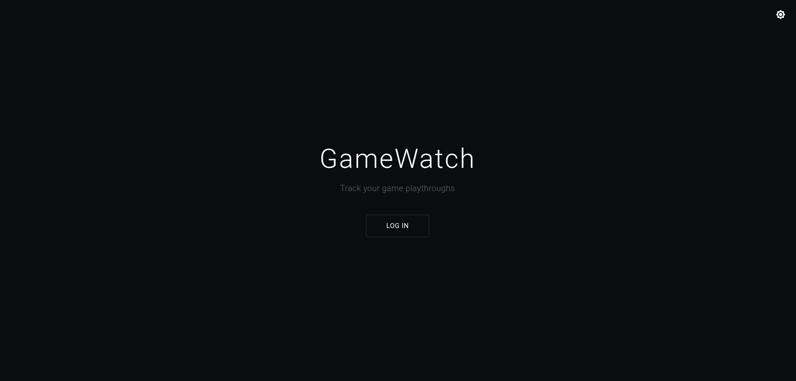

  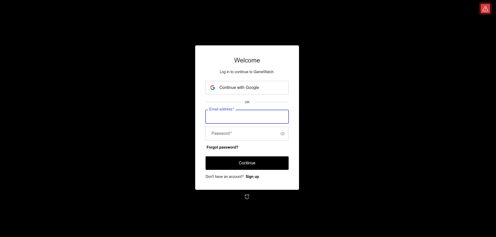

### Managing Your Account

Access your profile from the user menu to:
- View your username and email
- See account creation date
- Change language preferences
- Log out

## Adding Games

### Searching for Games

1. Click the **Add Game** button
2. Type the game name in the search box
3. Results appear from the RAWG database with cover art and details
4. Click on a game to add it

**Search tips:**
- Use partial names ("Elden" finds "Elden Ring")
- Check the release year if multiple versions exist
- Popular games appear first in results

  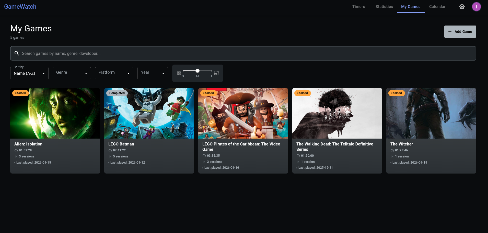

  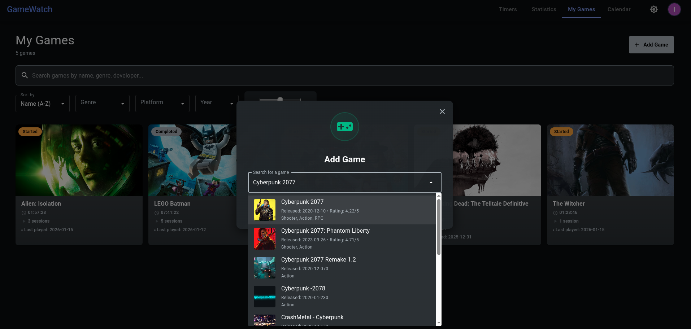

### Game Information

Each game shows:
- Cover artwork
- Title and release date
- Platforms available
- Genre and rating
- Developer/publisher info

## Managing Playthroughs

### Using the Timer

GameWatch includes a built-in timer to automatically track your gaming sessions in real-time.

  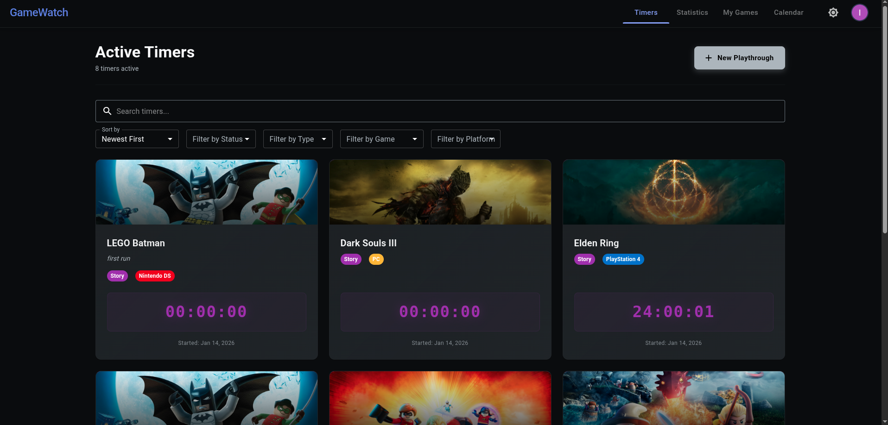

**To use the timer:**
1. Select a game from the dropdown
2. Click **Start** to begin tracking
3. The timer counts your playtime automatically
4. Click **End Session** when you finish your session
5. The playtime is saved to your playthrough

**Timer features:**
- Dynamic background colors based on game cover art
- Pause/resume functionality
- Real-time playtime tracking
- Automatic session logging

  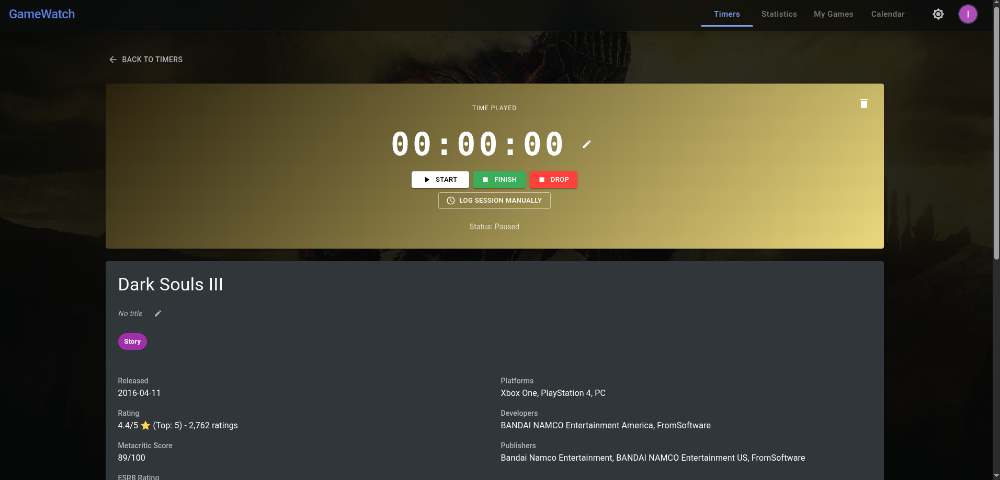

  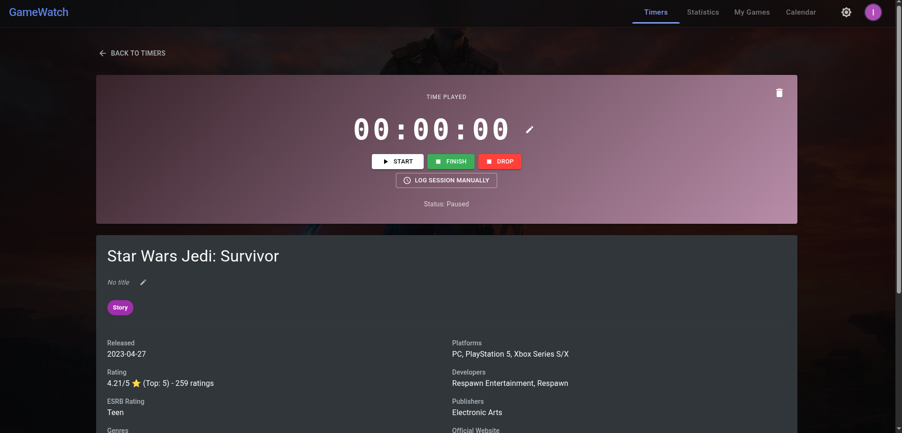

  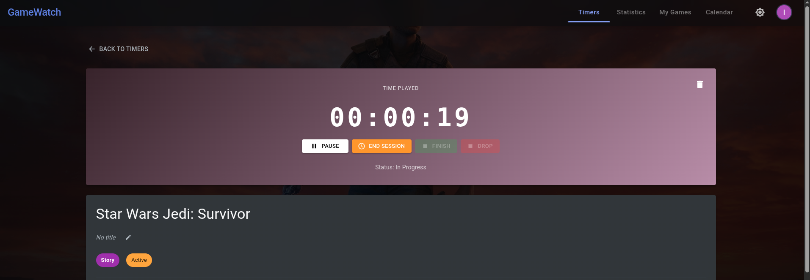

### Logging Sessions Manually

You can also log gaming sessions manually without using the timer.

  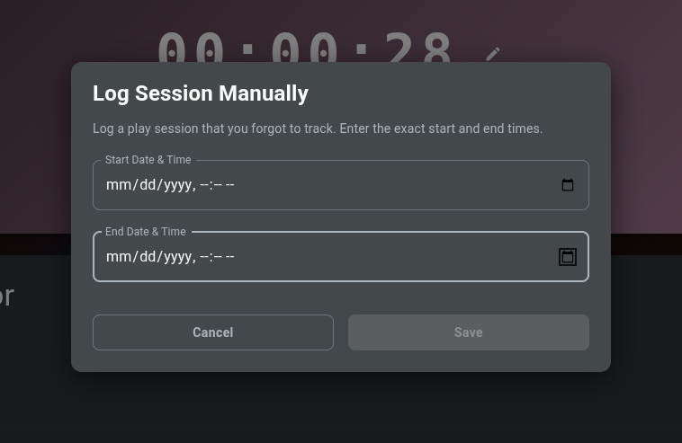

  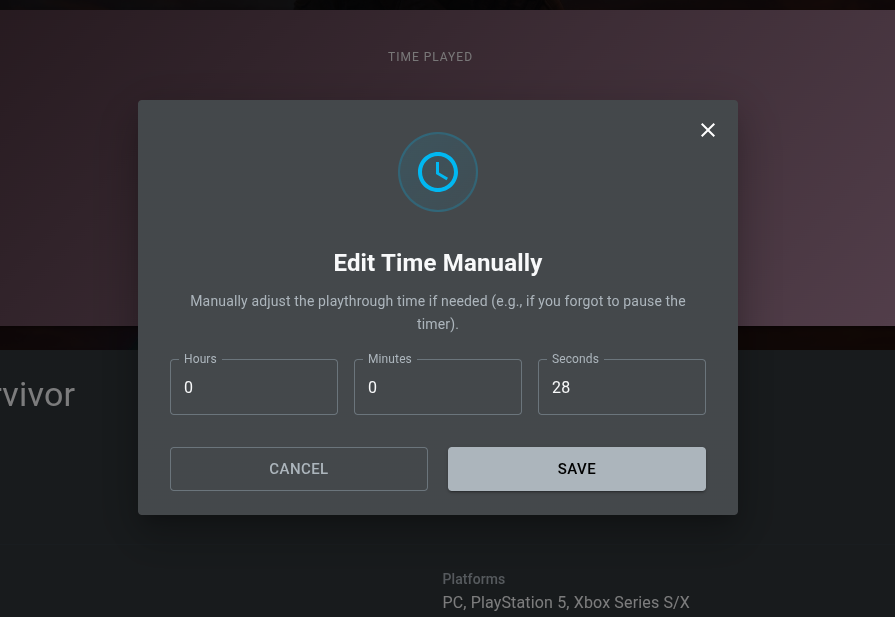

### Creating a Playthrough

After selecting a game:
1. **Title**: Optional comments about your playthrough
2. **Mode**: What type of playthrough will it be?
   - **Story**: Standard playthrough focusing on the main story
   - **100%**: Complete everything the game has to offer
   - **Speedrun**: Racing against time
   - **Casual**: Relaxed gameplay without specific goals
3. **Platform**: Where you played (PC, PlayStation, Xbox, Switch, etc.)
4. **Start Date**: When you began playing

Click **Create New Playthrough** to add the playthrough to your collection.

  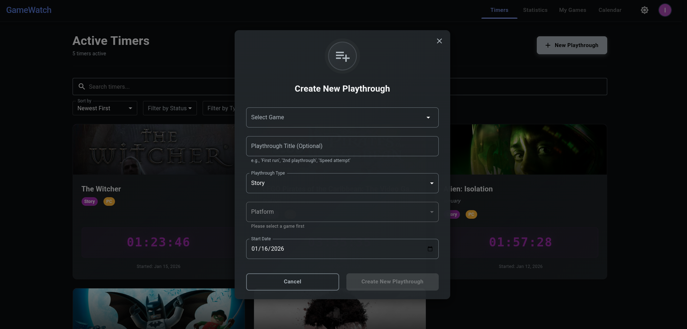

  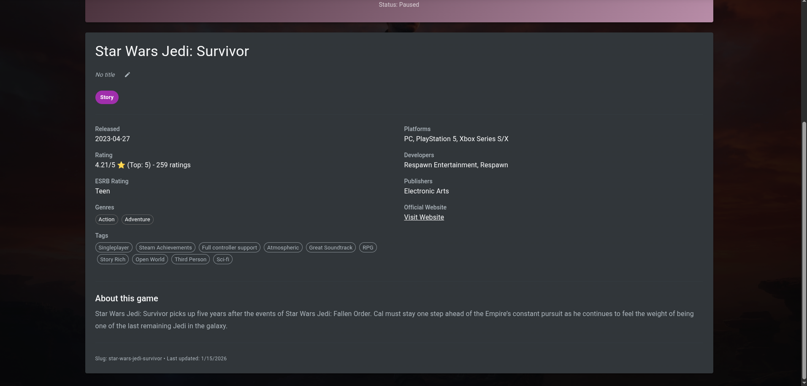

### Playthrough Types

GameWatch supports different completion goals:

- **Story**: Focus on completing the main storyline
- **100%**: Collect everything, complete all achievements, max out the game
- **Speedrun**: Complete the game as fast as possible
- **Casual**: Play at your own pace without specific completion goals

Each type is color-coded in the UI for easy identification.

### Importing Sessions (100% Playthroughs)

If you're doing a 100% playthrough after completing the story, you can import your playtime from a previous playthrough of the same game.

**To import sessions:**
1. Create a new **100%** playthrough for the game
2. Open the playthrough detail page
3. Click the **Import** button
4. Select the playthrough you want to import time from
5. Confirm the import

**Important notes:**
- Only works for 100% playthroughs
- You can only import once per playthrough
- Only the total playtime is added, not individual session records
- The source playthrough remains unchanged

### Editing Playthroughs

To update an existing entry:
1. Find the playthrough in your list or calendar
2. Click the edit icon
3. Modify any fields
4. Save your changes

### Deleting Playthroughs

Click the delete icon on any playthrough and confirm. This action cannot be undone.

  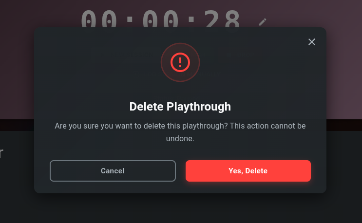

### Playthrough Statuses

- **In Progress**: Currently playing
- **Completed**: Finished the main story or goals
- **Paused**: Taking a break
- **Dropped**: Stopped playing permanently (or for a while)

### Dropping and Picking Up Games

Sometimes you want to stop playing a game but aren't sure if you'll return to it. GameWatch's drop/pickup feature lets you manage games you've set aside.

**Dropping a Game:**
1. Open the playthrough detail page
2. Click the **Drop** button
3. Confirm the action

When you drop a game:
- The playthrough is marked as "Dropped"
- Your playtime is preserved
- The end date is set to when you dropped it
- The game won't appear in your active games list

**Picking Up a Dropped Game:**

Changed your mind? You can resume a dropped game anytime:
1. Find the dropped playthrough in your games list
2. Open the playthrough detail page
3. Click the **Pick Up** button
4. Confirm to resume

When you pick up a game:
- The "Dropped" status is removed
- The end date is cleared
- You can start new sessions immediately
- All previous playtime remains intact

**Use cases:**
- Game got too difficult - drop it and maybe return later
- Lost interest but might want to try again
- Taking a break from a long RPG
- Waiting for DLC or updates before continuing

## Calendar View

The calendar displays all your gaming sessions visually.

**Features:**
- Each playthrough appears as an event on its date range
- Color-coded by status
- Click any event to see details
- Navigate months with arrow buttons

**Calendar tips:**
- Events spanning multiple days show the full range
- Use the month/year view toggle for different perspectives

  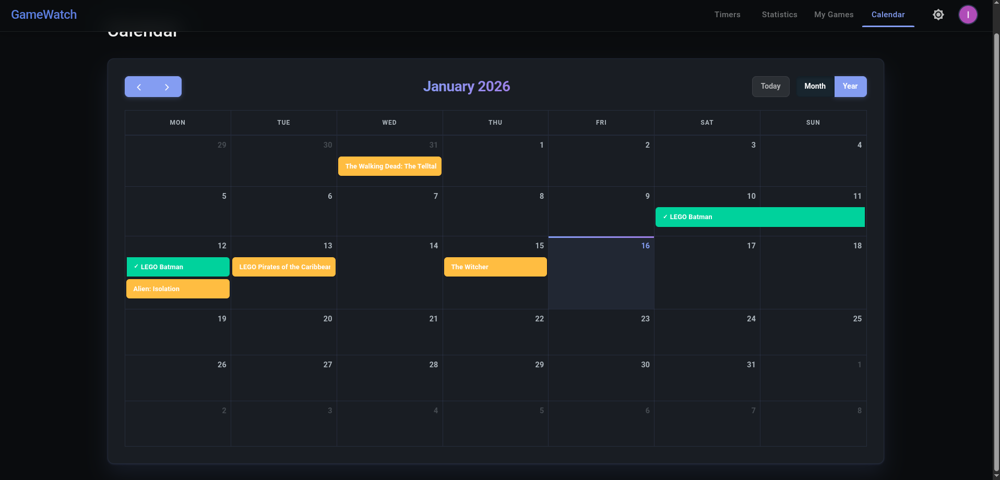

## Statistics & Analytics

View detailed insights about your gaming habits on the Statistics page.

  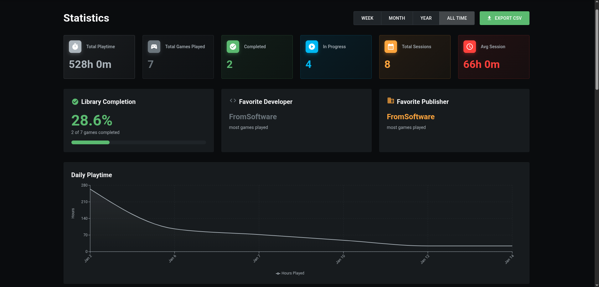

  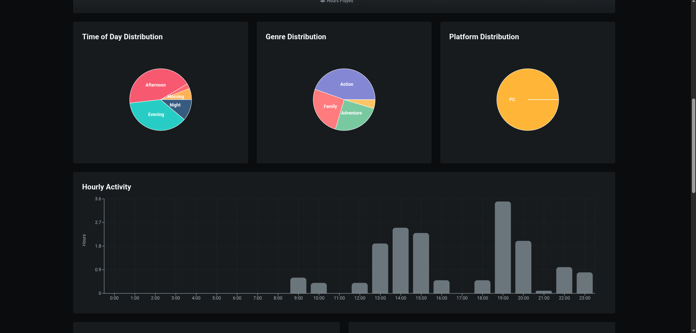

  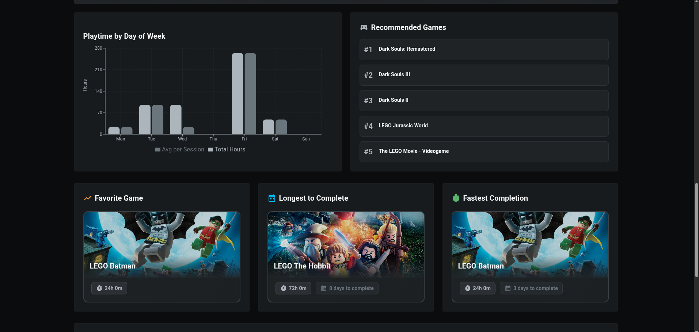

  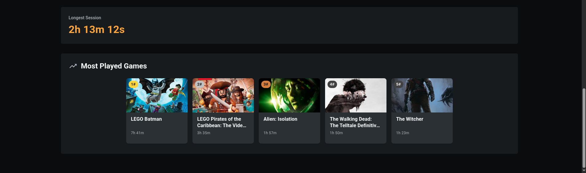

  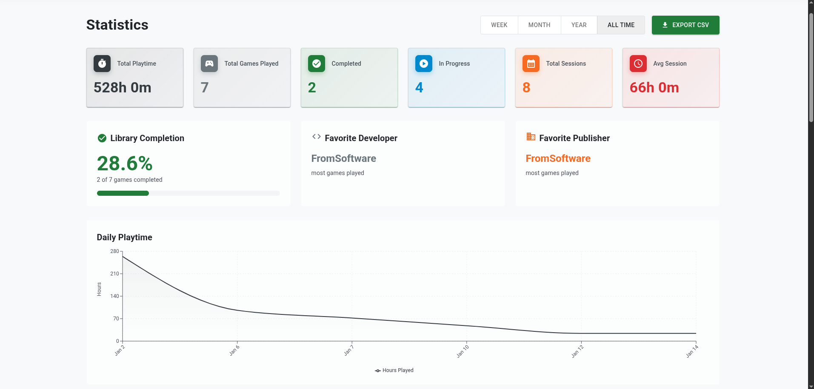

  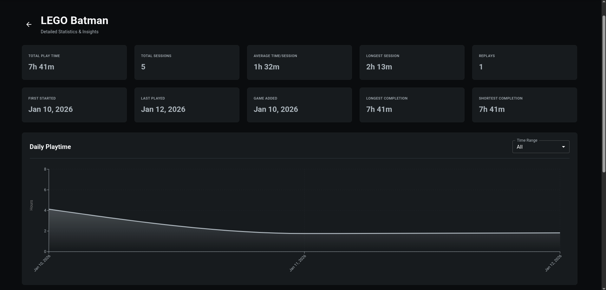

  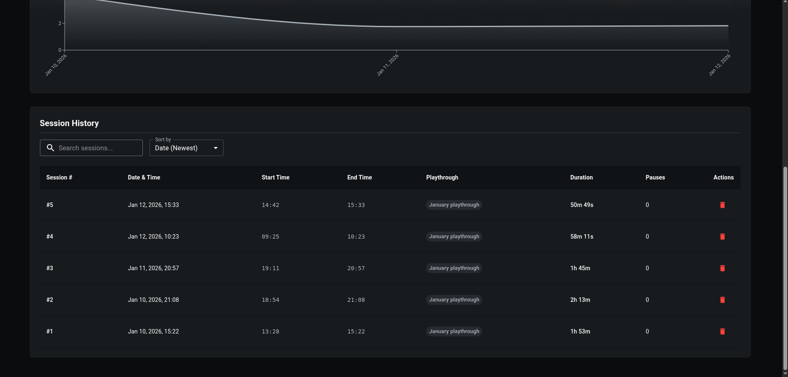

### Available Charts

**Playtime by Day**: Bar chart showing hours per day of the week  
**Platform Distribution**: Pie chart of time across platforms  
**Time Activity**: Line graph tracking hours per week/month/year/all time  
**Completion Rate**: Percentage of games completed 
**Genre Breakdown**: Your most-played genres

### Filtering Statistics

Use the date range picker to view stats for:
- This week
- This month
- This year
- All time

### Exporting Data

Click **Export** to download your playthrough data as CSV for external analysis.

  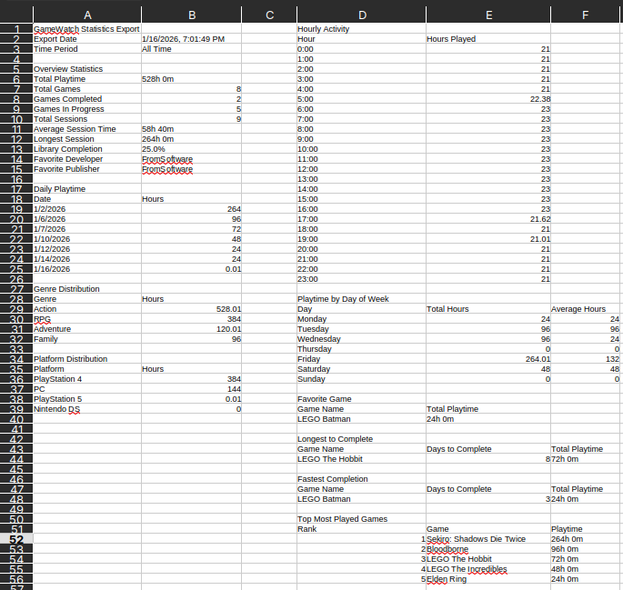

## Settings & Preferences

  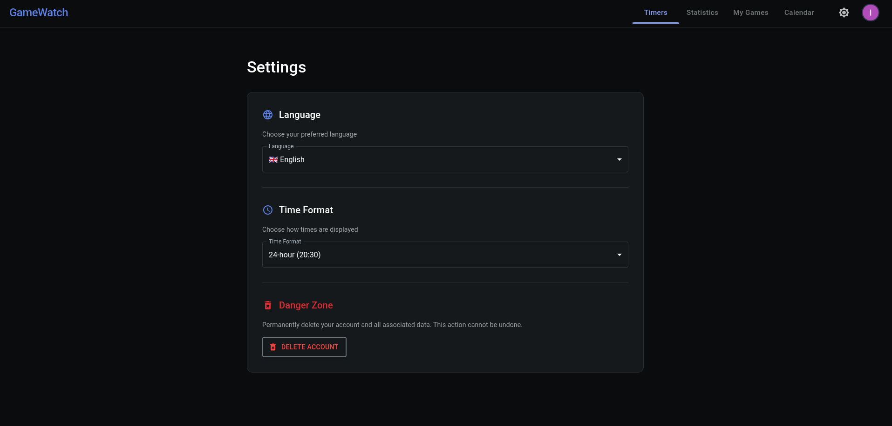

### Language

GameWatch supports multiple languages. Switch via the language selector in the user menu:
- English
- Hungarian
- Spanish
- French
- German
- Russian
- Japanese
- Chinses (simplified)
- Arabic
- Italian
- Portugese

  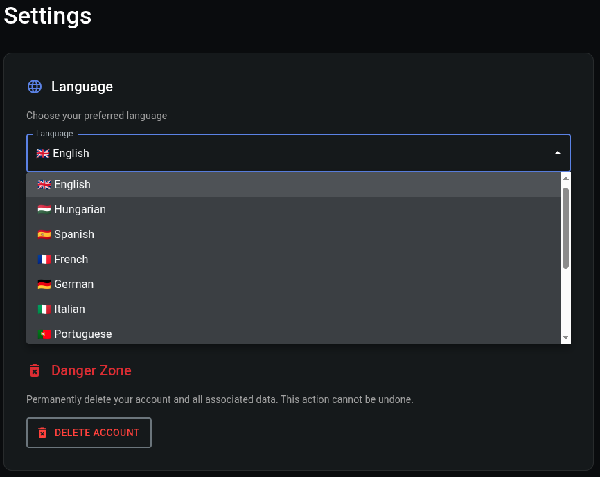

  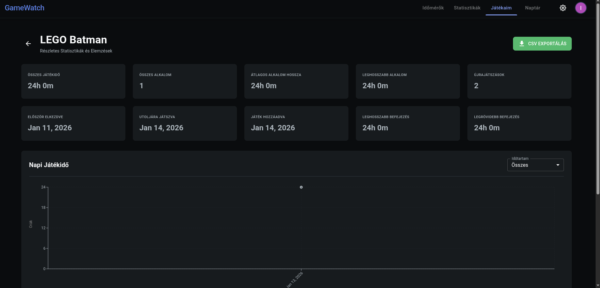

### Display Options

Customize your experience:
- Dark/light theme (follows system preference)
- Time format (12h or 24h)

## Troubleshooting

### Games Not Loading

If search results don't appear:
- Check your internet connection
- The RAWG API may be temporarily down
- Try a different search term
- Refresh the page

### Authentication Issues

If you can't log in:
- Clear browser cache and cookies
- Try a different browser
- Verify your Auth0 credentials

### Data Not Saving

If playthroughs don't save:
- Ensure all required fields are filled
- Check that dates are valid (start before end)

---

